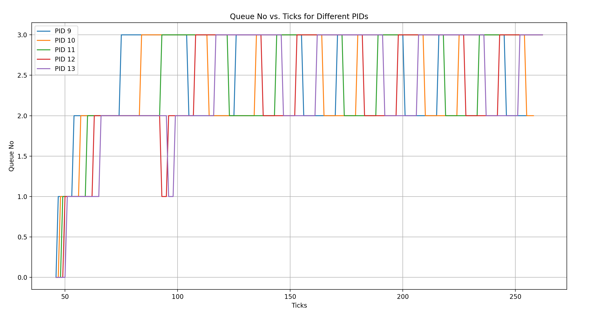
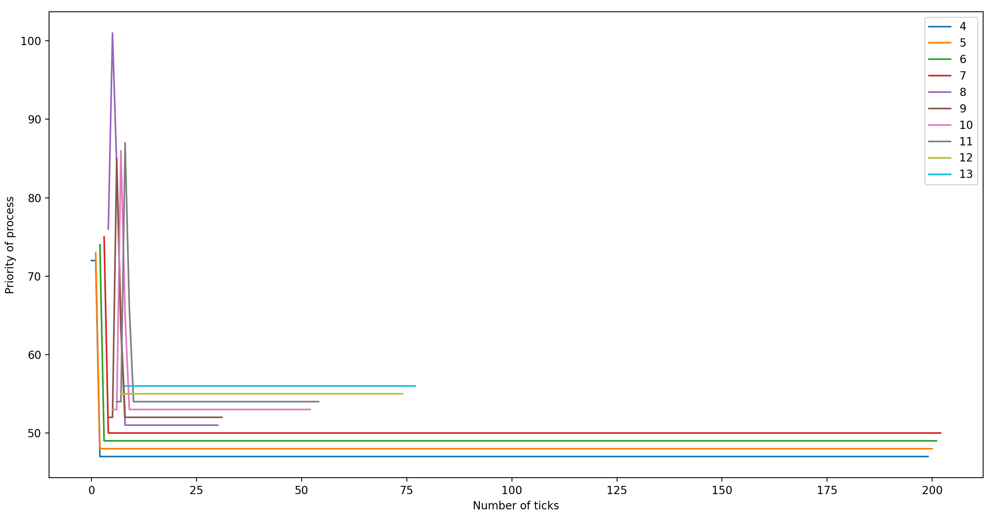

# XV6 Operating System - Custom Scheduling Algorithms

This project enhances the XV6 operating system by implementing two custom scheduling algorithms, First Come First Serve (FCFS) and Multi-Level Feedback Queue (MLFQ), and allows selecting one of them at compile time.


# Round-Robin(RR)
Round Robin is a preemptive scheduling algorithm that assigns each process a fixed time quantum or time slice. Processes are executed in a circular manner, and each process runs for its allotted time slice before being moved to the back of the queue. This ensures that no single process monopolizes the CPU for an extended period.
**Implementation Overview:**

### Initialization:
- The code snippet begins by initializing a loop variable p as a pointer to the process structures (struct proc). It also initializes the c->proc pointer to 0.

### Iterating Through Processes:
- The code uses a for loop to iterate through all processes (p) within the range of proc to &proc[NPROC]. proc is an array of process structures.

### Checking Runnable Processes:
- If the current process is in the RUNNABLE state, it is eligible for execution under the Round Robin scheduling policy.
- The process's state is changed to RUNNING, indicating that it is currently executing.
- The c->proc pointer is updated to point to the selected process (c->proc = p), indicating that this process is currently running.

### Context Switching:
- The swtch(&c->context, &p->context) function is called to perform a context switch from the current process (c->context) to the selected process (p->context).
- Context switching is a fundamental operation in multitasking operating systems. It involves saving the state of the currently running process and restoring the state of the newly selected process so that execution can continue from where it left off.

### Process Termination:
- After the context switch, the selected process is allowed to execute for its time slice or until it voluntarily yields the CPU.
- Upon completion of execution (or yielding), the selected process should have changed its state to an appropriate value (e.g., RUNNING, SLEEPING, or ZOMBIE) to indicate its status.
        The c->proc pointer is reset to 0 to indicate that there is currently no running process.


# First Come First Serve (FCFS)
First-Come, First-Served (FCFS) is a non-preemptive scheduling algorithm that assigns CPU time to processes based on the order in which they arrive. The process that arrives first gets executed first, and processes are executed in the order of their arrival.
**Implementation Overview:**

### Initialization:
- It begins by declaring a temporary process pointer min and initializing it to 0. This pointer is used to track the process with the earliest creation time (ctime).
- A flag variable flag is initialized to 0, which will be used to determine if there are any RUNNABLE processes.

### Process Selection:
- The code uses a for loop to iterate through all processes (p) within the range of proc to &proc[NPROC]. proc is an array of process structures.
- Within the loop, the code acquires the lock for the current process (acquire(&p->lock)) to ensure mutual exclusion while checking its state.

### Checking Runnable Processes:
- If the current process is in the RUNNABLE state, it is a candidate for execution.
- The flag variable is set to 1 to indicate that at least one RUNNABLE process has been found.
- The code then checks if min is 0 (indicating that no process has been selected yet) or if the ctime (creation time) of the current process (p->ctime) is less than the ctime of the currently selected min process.
- If either of these conditions is met, the min pointer is updated to point to the current process (min = p), indicating that this process has the earliest creation time.

### Process Execution:
- After the loop completes, the code checks if flag is 1, indicating that at least one RUNNABLE process has been found.
- If there are RUNNABLE processes, the code acquires the lock for the process pointed to by min (acquire(&min->lock)).
- It then checks if the min process is still in the RUNNABLE state (as its state might have changed during lock acquisition due to a context switch).
- If the process is still RUNNABLE, it is marked as RUNNING, and its context is switched to using swtch(&c->context, &min->context). This context switch allows the selected process to start executing on the CPU.
- The scheduler (c->proc) is updated to reflect the newly running process.
- Finally, the process lock is released (release(&min->lock)), allowing other processes to access it.

### Yielding the CPU:
- The code segment also contains an additional check related to which_dev and the state of the current process (myproc()).
- If which_dev is 2 (indicating a specific device condition) and the current process is running (myproc() != 0 and myproc()->state == RUNNING), it calls yield().
- This check suggests that the FCFS scheduler may yield the CPU in certain conditions, which might be specific to the behavior of this particular XV6 implementation.

# Multi-Level Feedback Queue (MLFQ)

Multi-Level Feedback Queue (MLFQ) is a scheduling algorithm that assigns processes to different priority queues based on their behavior. Each queue has a different time quantum, and processes can move between queues based on their behavior and execution time. MLFQ aims to provide better responsiveness to interactive tasks and better throughput for CPU-bound tasks.

**Implementation:**
### Initialization:
- At the beginning, a temporary process pointer temp is declared and initialized to 0. This pointer will be used to track the process selected for execution.
- A flag variable flag is also initialized to 0, which will be used to determine if a process is selected for execution.

### Process Selection:
- The code iterates through all processes (p) using a for loop, where p ranges from proc to &proc[NPROC]. proc is an array of process structures.
- Inside the loop, the code acquires the lock for the current process using acquire(&p->lock) to ensure mutual exclusion.
- If the current process is in the RUNNABLE state, it is a candidate for execution.
- The code then checks various conditions to determine which process to select:
-  It compares the ctime (creation time) of the current process with the ctime of the temp process (which may be 0 initially).
- If the current process has a smaller ctime (indicating it was created earlier) or belongs to a queue with a smaller priority (que_no), it is selected as the candidate for execution.
- The selected process is assigned to the temp pointer, and the flag is set to 1 to indicate that a process has been selected.

### Process Execution:
- After the loop completes, the code checks if flag is 1, indicating that a process has been selected for execution.
- If a process has been selected, the code acquires the lock for that process and checks if it is still in the RUNNABLE state (since its state might have changed during lock acquisition due to a context switch).
- If the process is still RUNNABLE, it is marked as RUNNING, and its context is switched to using swtch(&c->context, &temp->context). This context switch allows the selected process to start executing on the CPU.
- The scheduler (c->proc) is updated to reflect the newly running process.
- The process lock is released (release(&temp->lock)), allowing other processes to access it.

### MLFQ Specifics:
The code also contains logic specific to MLFQ scheduling:
- It checks if which_dev is equal to 2, indicating that MLFQ-specific operations should be performed.
- Processes' counter_of_ticks is incremented, tracking how long a process has run.
The code iterates through all processes again to perform various MLFQ-related actions:
- Aging: Processes that have waited for too long (ticks - p->in_time >= 30) are promoted to a higher-priority queue (p->que_no--) and have their variables reset.
- Time Quantum Management: Processes in the queue are checked to see if they have exceeded their time quantum based on their queue number. If so, their priority is decreased (temp->que_no++), and related variables are modified.
- The yield function is called to schedule the next process.

Processes in the BLOCKED state that become RUNNABLE are scheduled immediately if they have a higher priority (temp->que_no).
Finally, processes are checked to see if they should yield the CPU to processes with higher priority (temp->que_no).


# Scheduling Algorithm Performance Comparison

 In this project, we've implemented and compared three popular scheduling algorithms: Round Robin (RR), First-Come, First-Served (FCFS), and Multi-Level Feedback Queue (MLFQ). The comparison is based on their average response time (rtime) and average waiting time (wtime).

## (rtime)

- **Round Robin (RR):** 21
- **First-Come, First-Served (FCFS):** 22
- **Multi-Level Feedback Queue (MLFQ):** 21

## (wtime)

- **Round Robin (RR):** 183
- **First-Come, First-Served (FCFS):** 144
- **Multi-Level Feedback Queue (MLFQ):** 185

## Here's how the average waiting times compare:

- **FCFS** stands out with the lowest average waiting time (144), indicating that processes spend less time waiting in the queue before execution.
- **RR** has a somewhat higher average waiting time (183) compared to FCFS, implying that processes, on average, wait longer in the queue before getting a chance to execute.
- **MLFQ** demonstrates a waiting time (185) close to that of RR, suggesting a similar average waiting time.

## Conclusion:

- **FCFS** performs exceptionally well in terms of average waiting time, offering the lowest waiting time for processes.
- **RR** and **MLFQ** exhibit similar average waiting times, with RR having a slightly lower average waiting time.


# The given graph shows the path of 5 processes through the priority queues with the ticks of the CPU at the moment plotted on the x-axis.
## AGING TIME = 30 ticks




# Priority-based Scheduling

This is a priority-based scheduling policy that chooses the process with the highest priority to execute. If two or more processes have the same priority, we break the tie using the number of times the process has been scheduled. If the tie persists, use the process's start time to break it (processes with lower start times are scheduled earlier).

We have static priority and dynamic priority here. Dynamic priority determines scheduling by varying with running, waiting and sleeping time. Dynamic priority is calculated using static priority.


## Implementation

- Once again, we use a 'for' loop to find the process with the highest priority (lowest dynamic priority),  In case two or more processes have the same priority, we use the number of times the process has been scheduled to break the tie. If the tie remains, use the start-time of the process to break the tie(processes with lower start times should be scheduled further). Then the selected process is scheduled to run. 
- Also in the scheduling function, the dynamic priority of the process is updated for all the process which are being checked to be scheduled or not.

- The number of ticks, start_time, run_time, wait_time, RBI and Dynamic Priority are stored in struct proc::p. In the Update_time() function, the values of these parameters are updated accordingly.

- struct proc stores the static priority (50 by default). When the process to be scheduled is selected, the RBI and dynamic priority are calculated in the loop.

- I also have used a separate global function named 'calculate_dp' which takes struct proc* as an argument and return the dynamic priority of this process, also updating the RBI whle calculating.

- A process's static priority can be modified using the 'set_priority()' system call. In this function, i have updated the static priority of the process and also set the RBI to 25 and Dynamic Priority of the process accordingly and also returns the old priority.

```bash
setpriority [priority] [pid]
```
# ANALYSIS of PBS scheduler:



Here, I will do analysis and tell how all parameters can affect the process of scheduling which is PBS and these are:-
# Effectiveness of Static Priority (SP): 
### Observation:
- SP represents the inherent priority of a process which ranges from 0 to 100. Lower SP values indicate higher priority for scheduling. It's default value for each process is 50. Analysis: Decreasing the SP(Static priority) of a process increases its priority, making it more likely to be scheduled. Increasing the SP lowers the priority, potentially delaying the process's execution. Outcome : So we can make a process to get scheduled fast or gets delayed by using SP(Static priority) parameter of a process by using set_priority system call.

# Effectiveness of RBI (RTime, WTime, STime):
### Observation:
- RBI is a weighted sum of Running Time (RTime), Sleeping Time (STime), and Waiting Time (WTime). RBI adjusts the dynamic priority based on recent behavior. It's default value will be 25 for each process.
### Running Time (RTime):
- The total time the process has been running since it was last scheduled. A process with high RTime might have a higher RBI, indicating a potential increase in dynamic priority and thus overall decrease the chances of that process to get rescheduled.
### Sleeping Time (STime): 
- The total time the process has spent sleeping (i.e., blocked and not using CPU time) since it was last scheduled. High STime decreases the RBI, potentially reducing dynamic priority which increases the chances of that process to get rescheduled with respect to others.
### Waiting Time (WTime):
- The total time the process has spent in the ready queue waiting to be scheduled. A process waiting for a long time may have a lower RBI as it is with minus sign in numerator so decreasing the RBI value, and decreasing the dynamic Priority and thus overall increasing priority to get scheduled.
### Weighted Sum:
- The weighted sum captures the overall recent behavior impact on priority.


Here, analysis is done and tell how all parameters can affect the process of scheduling which is PBS and these are:-

# Effectiveness of Static Priority (SP): 
### Observation:
- SP represents the inherent priority of a process which ranges from 0 to 100. Lower SP values indicate higher priority for scheduling. It's default value for each process is 50. Analysis: Decreasing the SP(Static priority) of a process increases its priority, making it more likely to be scheduled. Increasing the SP lowers the priority, potentially delaying the process's execution. Outcome : So we can make a process to get scheduled fast or gets delayed by using SP(Static priority) parameter of a process by using set_priority system call.

# Effectiveness of RBI (RTime, WTime, STime):
### Observation:
- RBI is a weighted sum of Running Time (RTime), Sleeping Time (STime), and Waiting Time (WTime). RBI adjusts the dynamic priority based on recent behavior. It's default value will be 25 for each process.
### Running Time (RTime):
- The total time the process has been running since it was last scheduled. A process with high RTime might have a higher RBI, indicating a potential increase in dynamic priority and thus overall decrease the chances of that process to get rescheduled.
### Sleeping Time (STime): 
- The total time the process has spent sleeping (i.e., blocked and not using CPU time) since it was last scheduled. High STime decreases the RBI, potentially reducing dynamic priority which increases the chances of that process to get rescheduled with respect to others.
### Waiting Time (WTime):
- The total time the process has spent in the ready queue waiting to be scheduled. A process waiting for a long time may have a lower RBI as it is with minus sign in numerator so decreasing the RBI value, and decreasing the dynamic Priority and thus overall increasing priority to get scheduled.
### Weighted Sum:
- The weighted sum captures the overall recent behavior impact on priority.

# Impact on Dynamic Priority (DP):

## Observation:
- DP is the minimum of (sum of SP and RBI) and 100. DP determines the order of process execution.
- Analysis: Processes with lower DP values get scheduled first. SP and RBI interact to dynamically adjust the priority. Frequent adjustments ensure responsiveness to changing behavior by using set_priority syscall.

## Average Turnaround Time:
### Advantages in Terms of Average Turnaround Time:
- Allows for prioritization of tasks, potentially leading to shorter turnaround times for high-priority tasks. Can be more adaptive to changing workload requirements, dynamically adjusting priorities.

### Disadvantages in Terms of Average Turnaround Time: 
- If priorities are not managed effectively, low-priority tasks may experience longer waiting times. Priority inversion issues, where high-priority tasks are blocked by lower-priority tasks, can impact average turnaround time.

## Throughput:
### Advantage:
- PBS can optimize throughput by allowing higher-priority tasks to be scheduled more frequently.
### Disadvantage:
- Lower-priority tasks may experience reduced throughput, potentially leading to resource starvation.

## Responsiveness:
### Advantage:
- PBS can provide better responsiveness by giving priority to high-priority tasks.
### Disadvantage:
- Low-priority tasks may experience reduced responsiveness or even starvation.

## Fairness:
### Advantage:
- PBS can be fairer than some other scheduling algorithms by allowing lower-priority tasks to execute.
### Disadvantage:
- In scenarios with a large number of high-priority tasks, lower-priority tasks may experience reduced fairness.

## Complexity:
### Advantage:
- PBS is flexible and allows dynamic adjustment of priorities, making it suitable for diverse workloads.
### Disadvantage:
- The flexibility introduces complexity in priority management and may lead to priority inversion issues.

## Implementation Overhead:
### Advantage:
- PBS can have a moderate implementation overhead compared to more complex algorithms.
### Disadvantage:
- The need for priority management can increase implementation complexity.

## Adaptability:
### Advantage:
- PBS is adaptable to changing workload requirements by dynamically adjusting priorities.
### Disadvantage:
- Frequent adjustments may lead to increased overhead and potential disruptions.

# Advantages of Priority-Based Scheduling (PBS):

## Prioritization:
- Allows tasks to be prioritized based on importance or urgency, leading to optimized scheduling for critical tasks.

## Flexibility:
- Can dynamically adjust priorities, making it suitable for environments with varying workload characteristics.

## Responsiveness:
- Provides better responsiveness by giving preference to high-priority tasks.

## Fairness:
- Can be fairer than some other scheduling algorithms, ensuring that lower-priority tasks are not completely starved.

# Disadvantages of Priority-Based Scheduling (PBS):

## Priority Inversion:
- May suffer from priority inversion issues, where high-priority tasks are blocked by lower-priority tasks.

## Starvation:
- If not managed effectively, low-priority tasks may face increased waiting times or even starvation.

## Complexity:
- The flexibility and prioritization introduce complexity in priority management and may require careful implementation.


# Bibliography

1. *ChatGPT Documentation:*
   - [OpenAI ChatGPT Documentation](https://platform.openai.com/docs/guides/chat)
   - [OpenAI GPT-3.5 Model Documentation](https://platform.openai.com/docs/models/gpt)

2. *GitBook.io Guides:*
   - [Markdown Guide on GitBook.io](https://xiayingp.gitbook.io/build_a_os/hardware-device-assembly/start-xv6-and-the-first-process)

3. *Github Co-Pilot:*
    - [Markdown Guide on Github-Co-Pilot Documentation](https://docs.github.com/en/copilot)


